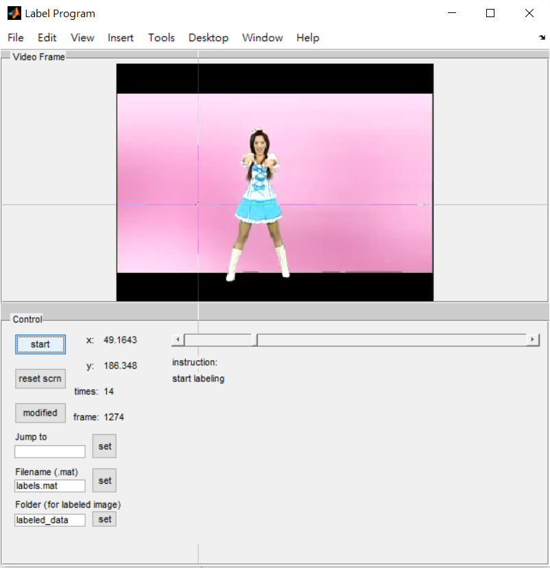

# LabelTool
This tool provides a GUI for labeling the positive samples. 
It was designed for code of the following Paper:
```
Yi Yang, Deva Ramanan, "Articulated Pose Estimation with Flexible Mixtures-of-Parts," CVPR 2011
```
It generate a `labels.mat` file that the train framework can use directly and a `grab_log.mat` 
which show the information of labeling data in `labels.mat`.

#### Fuctionality
-	sliding bar to Jump to the frame you want in the input video
- textbox to set the output folder
- textbox to modify the output filename

#### Usage 
Press "start" and click on the location of body joint to label. It will output the label file 
`labels.mat` and log file `grab_log.mat`. Also it will save the frame you choose to label.


